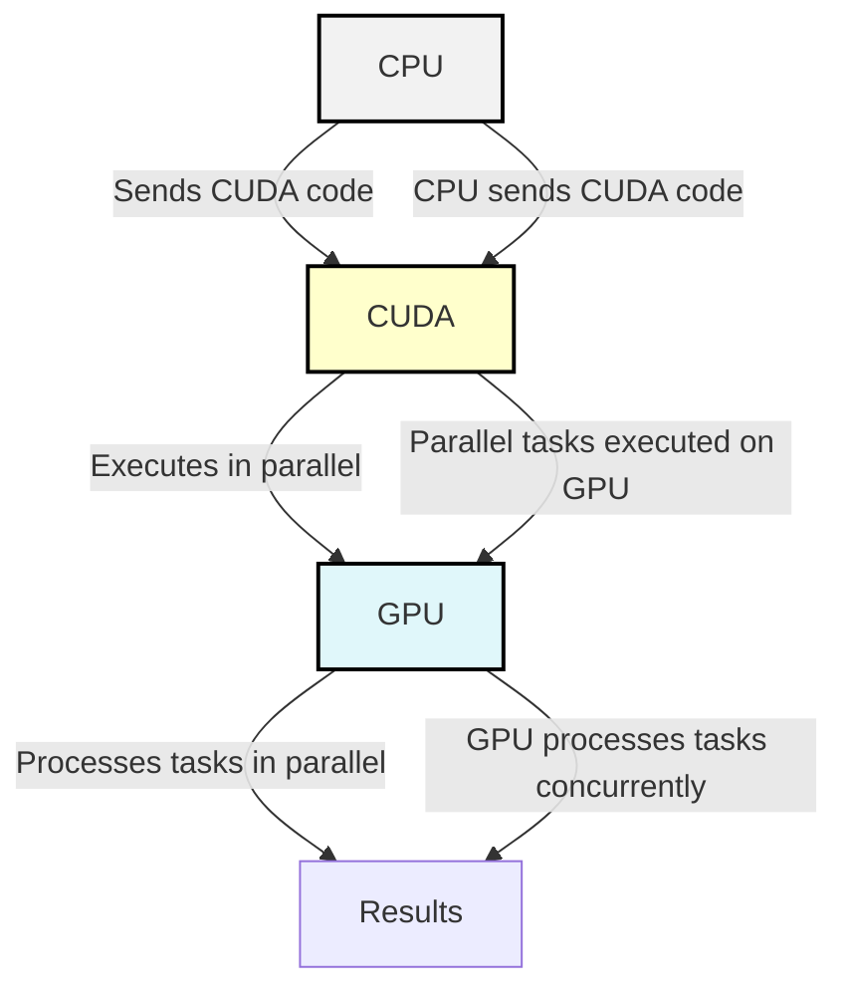
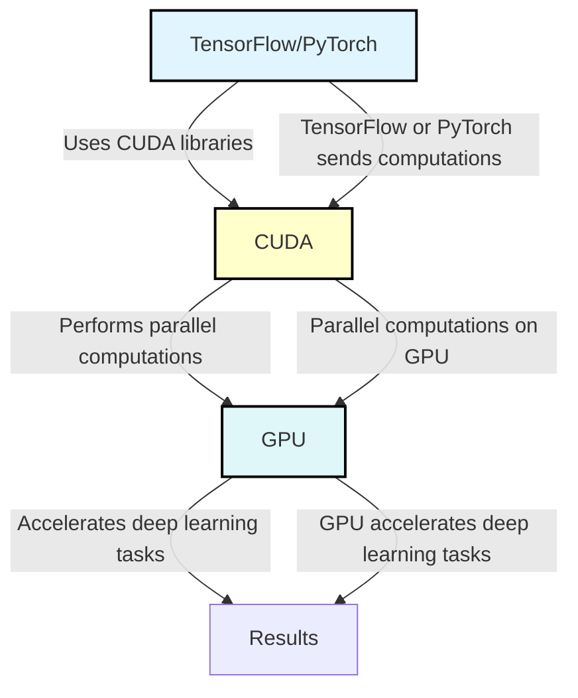

# How Does CUDA Actually Work?

CUDA is far more than a single entity—it's a comprehensive, multi-layered platform that integrates a wide array of technologies, software libraries, and low-level optimizations, collectively creating a robust parallel computing ecosystem. At its core, CUDA allows developers to harness the full power of NVIDIA GPUs, enabling massive parallelism that accelerates computations far beyond what a CPU alone can achieve.

<Youtube id="-P28LKWTzrI?start=15" width="450" height="250" />

<Youtube id="-P28LKWTzrI?start=71" width="450" height="250" />

<!-- ======================================================================================== -->

**Low-level**:  Parallel programming model that lets developers tap into the raw power of GPUs using a C++-like syntax.

<Arrow x1="420" y1="150" x2="550" y2="150" />

<!-- ======================================================================================== -->

**Complex set of libraries and frameworks—middleware** that supports critical vertical use cases, such as AI, with tools like cuDNN for PyTorch and TensorFlow.

**Suite of high-level solutions**: Such as TensorRT-LLM and Triton, which simplify AI workloads like LLM serving, allowing users to leverage CUDA’s power without needing deep expertise in the platform itself.

<Arrow x1="420" y1="330" x2="550" y2="330" />

---
level: 2
clicks: 2
---

<h1>How Does CUDA Actually Work?</h1>

## CPU vs. GPU: Key Differences

CPUs were designed to excel at executing a sequence of operations, called a thread, as fast as possible. They can execute a few tens of these threads in parallel. CPUs rely on large data caches and complex flow control to avoid long memory access latencies.

GPUs were designed to excel at executing many thousands of threads in parallel. They were originally developed for the highly-parallel task of graphic processing, prioritizing data processing over data caching and flow control. This design allows the GPU to hide memory access latencies with computation, instead of using large caches and complex flow control.

