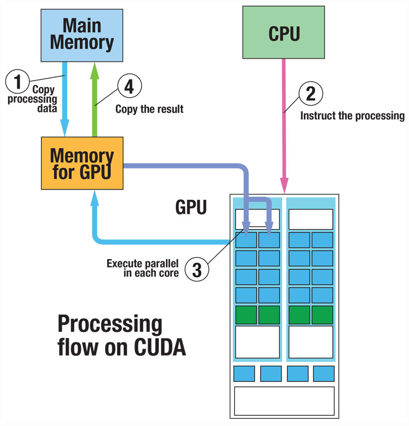
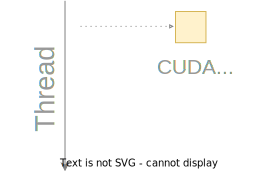
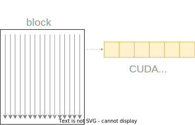
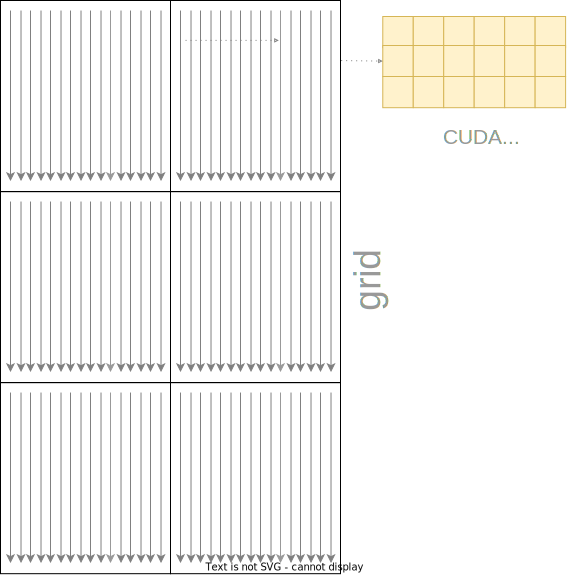
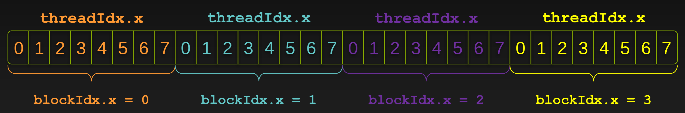

# So, How Do You Write CUDA Code Anyway?

<h2>CPUs problem</h2>

<div style="width: 40%;">
```python
# Function to compute Y = W * X + B
def linear_layer(Y, N, B, n):
    X = [0] * n
    for i in range(n):
        X[i] = Y[i] * N[i] + B[i]
    return Y
```
</div>

<div style="position: absolute; left: 50%; top: 22%; width: 40%;">
Parallelization on CPUs typically involves threads that execute instructions independently. For example, a for-loop performing operations on arrays can be parallelized by assigning each iteration to a separate thread.
</div>

<blockquote v-click="[1]" style="position: relative; top: 1%;">
  😓 But it iterates over the elements of the arrays one by one, computes the individual result, and stores it in the output array.
</blockquote>

<!-- ================================== -->
<div style="position: relative;left: -2%; top: 15%;width: 40%;">

$$ {hide|1|2}{at:'2'}
Independent=
\begin{cases}
X[i] &= Y[i] * N[i] + B[i] \\ 
X[j] &= Y[j] * N[j] + B[j]
\end{cases}
$$
</div>

<p v-click="[3]" style="position: relative; left: 50%; top: -10%; width: 55%;">
Modern CPUs are limited in parallelism due to having a limited number of cores (usually no more than 16). While GPUs can handle multiple threads with multi-threading, deep learning tasks, which involve large vectors and matrices, benefit from GPUs. GPUs can execute millions of threads in parallel, vastly improving performance for these computation-heavy operations.
</p>

---
clicks: 1
level: 2
---

<h1>So, How Do You Write CUDA Code Anyway?</h1>

<div v-click="[0, 2]">

## Terminology
</div>

<div v-click="[0]">

- **Host**: Refers to the CPU and its memory.
- **Device**: Refers to the GPU and its memory.
</div>

<div v-click="[1]"  style="position: absolute; top: 25%; width: 40%;">

- **Host Code**: Code that runs on the CPU.
- **Device Code**: Code that runs on the GPU.
- **Host Memory**: Memory accessible by the CPU.
- **Device Memory**: Memory accessible by the GPU.
- **Host-to-Device Transfer**: Copying data from the host memory to the device memory.
- **Device-to-Host Transfer**: Copying data from the device memory to the host memory.
</div>

<div v-click="[0]" style="position: absolute; top: 40%; left: 20%; width: 100%; text-align: center;">


</div>


<div v-click="[1]">

<div style="position: absolute; top: 20%; left: 50%; width: 40%; text-align: center;">


</div>

<svg  style="position: absolute; top: 105px; left: 480px; width: 420px; height: 270px;">
  <rect width="410px" height="125px" style="fill: none; stroke: red; stroke-width: 2"/>
</svg>

<svg  style="position: absolute; top: 230px; left: 480px; width: 420px; height: 600px;">
  <rect width="410px" height="300px" style="fill: none; stroke: red; stroke-width: 2"/>
</svg>

[HOST]{style="position: absolute; top: 15%; left: 50%; width: 40%;font-size: 20px;; color: red"}
[DEVICE]{style="position: absolute; top: 43%; left: 82%; width: 40%;font-size: 20px;; color: red"}

</div>


---
level: 2
clicks: 3
---

<h1>So, How Do You Write CUDA Code Anyway?</h1>

## CUDA Kennels





<Arrow v-click="[0]" x1="340" y1="350" x2="420" y2="350" />

<!-- ===================================================================== -->




<Arrow v-click="[1]" x1="340" y1="400" x2="420" y2="400" />

<!-- ===================================================================== -->


<Arrow v-click="[2]" x1="300" y1="300" x2="420" y2="400" />

<!-- ===================================================================== -->


---
level: 2
---

<h1>So, How Do You Write CUDA Code Anyway?</h1>

## Execution Workflow
  
<div  v-click="[0,4]" style="position: absolute; top: 25%; left: 5%; width: 45%; border: 1px solid #ccc; padding: 5px; text-align: center;">
    <h3>Preparation on the host</h3>
    The host CPU executes the main part of the CUDA program, setting up data in its own memory, and preparing instructions.
</div>

<div style="position: absolute; top: 25%; left: 53%; width: 45%;">

```cpp {none|3-4|6-10|12-18|hide}{at:'1'}
int main()
{
    int size = 1024;  // Size of the arrays
    int bytes = size * sizeof(float);

    // Allocate memory for host arrays
    float *h_X = new float[size];
    float *h_Y = new float[size];
    float *h_N = new float[size];
    float *h_B = new float[size];

    // Initialize the host arrays with some values
    for (int i = 0; i < size; ++i)
    {
        h_Y[i] = 1.0f * i;
        h_N[i] = 2.0f * i;
        h_B[i] = 3.0f * i;
    }
...
```
</div>

<div  v-click="[4,7]" style="position: absolute; top: 25%; left: 5%; width: 45%; border: 1px solid #ccc; padding: 5px; text-align: center;">
    <h3>Data transfer</h3>
    Before the GPU can begin processing, the necessary data must be transferred from the host’s memory to the device’s memory.
</div>

<div style="position: absolute; top: 25%; left: 53%; width: 45%;">

```cpp {hide|none|2-7|9-12|hide}{at:'4'}
    ...
    // Allocate memory for device arrays
    float *d_X, *d_Y, *d_N, *d_B;
    cudaMalloc(&d_X, bytes);
    cudaMalloc(&d_Y, bytes);
    cudaMalloc(&d_N, bytes);
    cudaMalloc(&d_B, bytes);

    // Copy host arrays to device memory
    cudaMemcpy(d_Y, h_Y, bytes, cudaMemcpyHostToDevice);
    cudaMemcpy(d_N, h_N, bytes, cudaMemcpyHostToDevice);
    cudaMemcpy(d_B, h_B, bytes, cudaMemcpyHostToDevice);
    ...
```
</div>


<div  v-click="[7,10]" style="position: absolute; top: 25%; left: 5%; width: 45%; border: 1px solid #ccc; padding: 5px; text-align: center;">
    <h3>Kernel launch</h3>
    The host directs the device to execute a kernel, and the GPU schedules and runs the kernel across its many threads
</div>

<div style="position: absolute; top: 25%; left: 53%; width: 45%;">

```cpp {hide|none|2-5|7-10|hide}{at:'7'}
    ...
    // Define number of threads and number of blocks
    int threadsPerBlock = 256;
    int blocksPerGrid = (size + threadsPerBlock - 1) 
                        / threadsPerBlock;

    // Launch the kernel
    vectorOperationKernel
                <<<blocksPerGrid, threadsPerBlock>>>
                (d_X, d_Y, d_N, d_B, size);
    ...
```
</div>

<div v-click="[8,9]">

  


  <svg style="position: absolute; top: 50%; left: 30%; width: 100%;">
    <rect width="150" height="120" style="fill: none; stroke: red; stroke-width: 2"/>
  </svg>

  <svg style="position: absolute; top: 50%; left: 13%; width: 340px; height: 270px;">
    <rect width="330" height="250" style="fill: none; stroke: blue; stroke-width: 2"/>
  </svg>

</div>

[🔴]{v-click="[8]" style="position: absolute; top: 180px; left: 530px;"}
[🔵]{v-click="[8]" style="position: absolute; top: 200px; left: 530px;"}

[🔵]{v-click="[9]" style="position: absolute; top: 265px; left: 740px;"}
[🔴]{v-click="[9]" style="position: absolute; top: 265px; left: 800px;"}

<div v-click="[10,13]" style="position: absolute; top: 25%; left: 5%; width: 45%; border: 1px solid #ccc; padding: 5px; text-align: center;">
    <h3>Post-processing</h3>
    After the GPU has finished executing the kernel, the results are typically transferred back to the host for further processing or output, completing the compute cycle.
</div>

<div style="position: absolute; top: 25%; left: 53%; width: 45%;">

```cpp {hide|none|2-3|5-13}{at:'10'}
    ...
    // Copy the result back to the host
    cudaMemcpy(h_X, d_X, bytes, cudaMemcpyDeviceToHost);

    // Clean up
    cudaFree(d_X);
    cudaFree(d_Y);
    cudaFree(d_N);
    cudaFree(d_B);
    delete[] h_X;
    delete[] h_Y;
    delete[] h_N;
    delete[] h_B;

    return 0;
}
```
</div>

---
level: 2
clicks: 6
---

<h1>So, How Do You Write CUDA Code Anyway?</h1>

## CUDA Kernel Execution

<div style="position: absolute; top: 25%; left: 53%; width: 45%;">

```cpp {all|1|5|5|5|5|6-9}
__global__ 
void vectorOperationKernel
  (float *X, float *Y, float *N, float *B, int size)
{
    int i = blockIdx.x * blockDim.x + threadIdx.x;
    if (i < size)
    {
        X[i] = Y[i] * N[i] + B[i];
    }
}
```
</div>

<div  v-click="[0]" style="position: absolute; top: 25%; left: 5%; width: 45%; border: 1px solid #ccc; padding: 5px; text-align: center;">

A CUDA kernel is a function written to run on the GPU, allowing for parallel execution across many threads. 

Each thread executes the same code but works on different data elements, enabling highly parallel computations. 

**Launch from Host**: Kernels are called from the host (CPU) using special launch syntax.

**No Return**: Kernels do not return values; they modify data in memory.

</div>


<div v-click="[1]" style="position: absolute; top: 25%; left: 5%; width: 45%; border: 1px solid #ccc; padding: 5px; text-align: center;">
  <h3>Device Code Flags</h3>
  
The __global__ qualifier marks a function as a CUDA kernel, executed on the GPU. It is called from the host (CPU) and runs in parallel across multiple threads, each processing different data elements.

<h3>Compilation process:</h3>
<code>nvcc</code> separates the source code into host and device components. <br>
    
`__device__` functions (as CUDA kernels) are processed by the NVIDIA compiler, while host functions (as main()) are processed by a standard host compiler (as `gcc`)
</div>

<div v-click="[2]" style="position: absolute; top: 25%; left: 5%; width: 45%; border: 1px solid #ccc; padding: 20px; text-align: left; overflow: auto;">
    
### Thread Indexing in CUDA

In CUDA, we use three components—`threadIdx.x`, `blockDim.x`, and `blockIdx.x`—to uniquely identify each thread within a grid of threads.

`threadIdx.x`: The index of the thread within its block along the x-axis.

`blockDim.x`: The number of threads per block along the x-axis.

`blockIdx.x`: The index of the block within the grid along the x-axis.
</div>

<div v-click="[3]" style="position: absolute; top: 25%; left: 5%; width: 45%; border: 1px solid #ccc; padding: 20px; text-align: left; overflow: auto;">
    

### Why is it used?

These components calculate a **unique index** for each thread, enabling **independent** work on different data elements for **parallel processing**. This speeds up computations by utilizing the GPU's **parallel architecture**, allowing threads to access and process data **concurrently**.


</div>

<div v-click="[4]" style="position: absolute; top: 25%; left: 5%; width: 45%; border: 1px solid #ccc; padding: 20px; text-align: left; overflow: auto;">
    
  ### Example

The formula above calculates a unique index for each thread in the entire grid. It combines the block index `blockIdx.x`, `blockDim.x`, `threadIdx.x` to produce a global index i.

For example, if you have 2 blocks with 2 threads each, the threads will be indexed from 0 to 3 as follows:

    Block 0, Thread 0: i = 0 * 2 + 0 = 0
    Block 0, Thread 1: i = 0 * 2 + 1 = 1
    Block 1, Thread 0: i = 0 * 2 + 0 = 2
    Block 1, Thread 1: i = 0 * 2 + 1 = 3

</div>

<div v-click="[5]">

  <div style="position: absolute; top: 25%; left: 5%; width: 45%; border: 1px solid #ccc; padding: 20px; text-align: left; overflow: auto;">
      
### Flatten a Vector?

Flattening the index calculation **optimizes memory access patterns**, ensuring **coalesced access** to reduce latency. Assigning each thread a unique 1D index **improves load balancing** and **scalability** for large datasets.

  </div>

  


</div>


<div v-click="[6]" style="position: absolute; top: 25%; left: 5%; width: 45%; border: 1px solid #ccc; padding: 5px; text-align: center;">

  The `if (i < size)` condition ensures that the code only operates on valid indices within the array bounds, preventing out-of-bounds access that could lead to memory errors or crashes. 
  
  In the statement `X[i] = Y[i] * N[i] + B[i];`, the index `i` is used to perform the operation `Y[i] * N[i] + B[i]`, and the result is stored in array `X` at the same index `i`.
</div>

---

# Let's Dive into Code
 


[Colab Notebook](https://colab.research.google.com/drive/1Nl3Ab0H21iQK1oiZpf501KyGj1RXHWaY#scrollTo=giiucWvb0dyg){style="position: absolute; top: 450px; left: 620px; font-size: 40px;"}


  <div style="position: absolute; top: 20%; left: 5%; width: 45%; border: 1px solid #ccc; padding: 10px; text-align: left; overflow: auto; font-size: 15px;">
      

### Simulation of Cases with Google Colab

We will use **Google Colab** to simulate two cases of operations in CUDA:

1. **Vector Addition**: We will perform the addition of two vectors to observe the efficiency and performance in a parallel environment.
2. **Matrix Multiplication**: We will implement the multiplication of two matrices and analyze CUDA's behavior with respect to high-volume operation execution.

These cases will help us evaluate the **performance** of CUDA in basic operations and validate the improvements compared to a sequential approach.

  </div>

