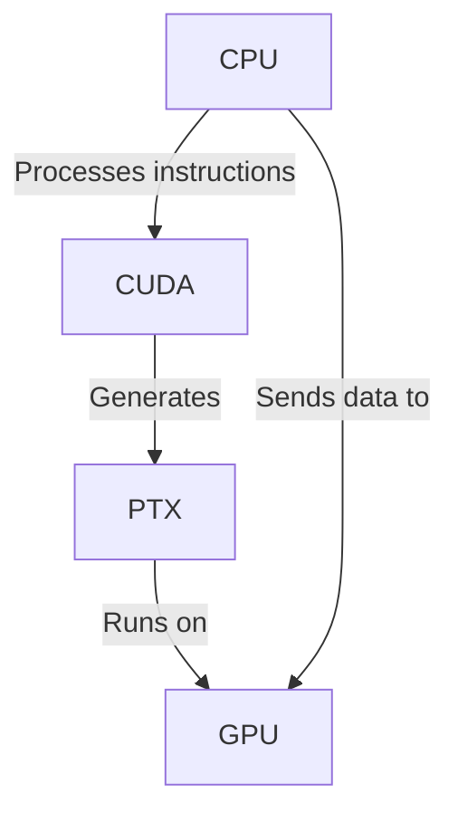

# What’s All the Hype About CUDA?
<!-- ======================================================================================== -->

<div  v-click="[0,2]">

<div style="position: absolute; height: 100vh; top:20%; left: 45%; width: 30%; text-align: center;">

Over the past year, it feels like CUDA has been everywhere. It’s the driving force behind _deep learning_, the reason new hardware has a hard time keeping up, and the key element behind NVIDIA’s competitive edge and skyrocketing market value.
</div>

<div  style="position: absolute; height: 100vh; top: 5%; left: 75%; width: 15%; text-align: center;">
    
</div>


<div  style="position: absolute; height: 100vh; top:20%; left: 2%; width: 30%;">

```python
import torch

tensor = torch.rand(100, 100).cuda()
```
</div>

<div  style="position: absolute; top: 33%; left: 10%; width: 100%; text-align: center;">
    
</div>

<Arrow x1="700" y1="125" x2="730" y2="70" />

</div>
<!-- ======================================================================================== -->

<div  v-click="[1]" style="position: absolute; top: 50%; left: 5%; width: 30%; text-align: center;">

[🤔]{style="font-size: 50px;"}<br><br>
[How CUDA works]{style="font-size: 30px;"}<br>
[under the hood?]{style="font-size: 30px;"}
</div>
<!-- ======================================================================================== -->
<div  v-click="[2,4]">
<div class="absolute left-6/10 w-1/3 top-1/2" style="text-align: center;">

With **DeepSeek**, we got a startling revelation: its breakthrough was made possible by “bypassing” CUDA, going directly to the PTX layer… but what does this actually mean? It feels like everyone wants to break past the lock-in, but we have to understand what we’re up against before we can formulate a plan.

</div>

<div  style="position: absolute; top: 25%; left: 70%; width: 15%;">
    
</div>

<div style="position: absolute; top: 20%; left: 35%;">


</div>

</div>

<!-- ======================================================================================== -->

<div v-click="[3]" style="position: absolute; top: 25%; left: 5%;  width: 25%; text-align: center;">

**CUDA**'s dominance in AI is unquestionable, yet most people don't fully grasp what CUDA actually is. 

Some believe it's a programming language, others refer to it as a _framework_, and many simply think of it as “that thing NVIDIA uses to make GPUs faster.” 

</div>


<div v-click="[4]">

<div style="position: absolute; top: 35%; left: 5%;  width: 25%; text-align: center;">

While none of these ideas are entirely incorrect—and many brilliant minds have tried to explain it—none fully capture the broad scope of "The CUDA Platform."
</div>

<div style="position: absolute; top: 20%; left: 35%;  width: 70%; text-align: center;">

<Tweet id="1884374138787357068"/>

</div>

</div>